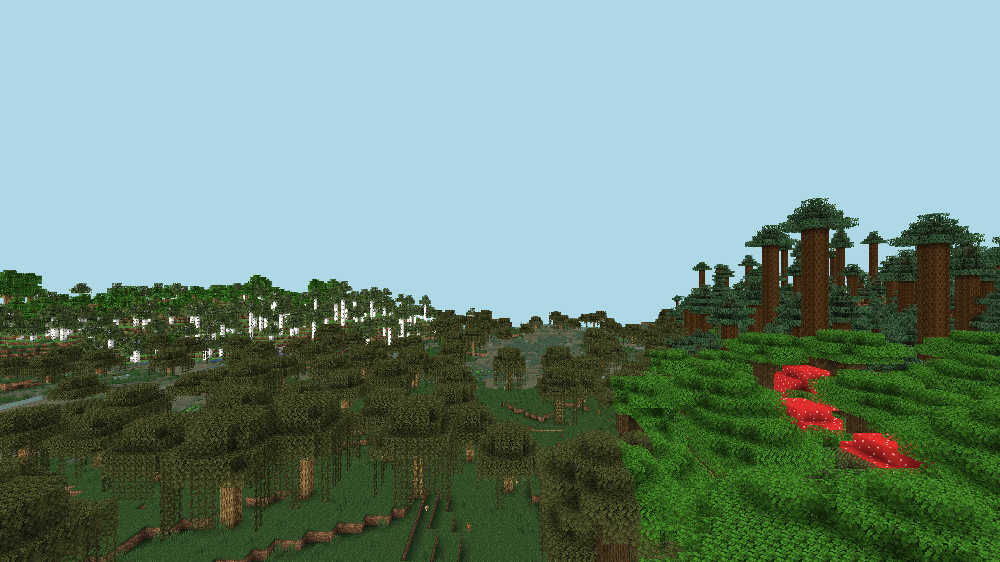
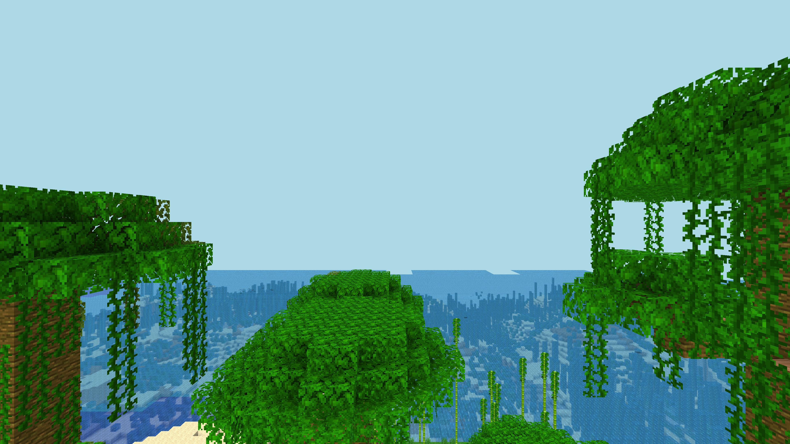

# Minecraft Screenshot

This projects aims to make Minecraft exploration
fun and automatic.

`screenshot.js`: mineflayer bot joins local Minecraft
server and takes a picture slightly above
spawn location.

`ai-caption.js`: loads picture from `output.jpg` and
captions it with AI

`index.js`: Starts Minecraft server, regenerates
world, handles shutdown, takes couple of images,
and sends results via telegram.


## Usage

For regular use:
```
npm start
```

To regenerage world:
```
node index.js regen
```

## Examples



